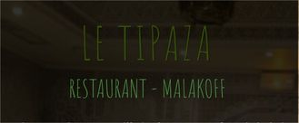

# Programme

**jeudi 6 juin 2019**	

---

09:00 &ndash; 09:15 : **Accueil**

*Mylène Chaleix* (DDSI)

---

09:15 &ndash; 09:45 : **Ouverture**

La valeur ajoutée de la DAAP et de la DSMR dans le cadre de la conception ou la modification de l'architecture d'une application et tout au long du cycle de vie.

*Mélanie Martin* (DAAP) et *Ykhlef Ouabi* (DSMR)

---

10:15 &ndash; 10:45	: **Traitement du langage naturel illustré sur Rmés et Web4G**

Reconnaître automatiquement les concepts dans des publications : vers un bout de datascience entre Rmes et Web4G ? Une branche du traitement du langage naturel consiste à reconnaître automatiquement des entités dans du texte de manière par exemple à identifier des personnes, des régions géographiques, des monnaies. Cela peut se présenter sous forme de WS. Rémy présentera les premiers résultats de son stage qui consiste à appliquer ce type de méthode sur des publications Insee, de manière à identifier notamment les concepts statistiques abordés, explicitement et si possible implicitement, ce qui pourrait à terme servir à faire automatiquement le labelling que les rédacteurs font manuellement aujourd'hui.

*Rémy Zirnheld* (DIIT)

---

10:45 &ndash; 11:15	: **Antlr : Outillage sur les contrôles, exemple avec le langage VTL**

Reconnaître automatiquement les concepts dans des publications : vers un bout de datascience entre Rmes et Web4G ? Une branche du traitement du langage naturel consiste à reconnaître automatiquement des entités dans du texte de manière par exemple à identifier des personnes, des régions géographiques, des monnaies. Cela peut se présenter sous forme de WS. Rémy présentera les premiers résultats de son stage qui consiste à appliquer ce type de méthode sur des publications Insee, de manière à identifier notamment les concepts statistiques abordés, explicitement et si possible implicitement, ce qui pourrait à terme servir à faire automatiquement le labelling que les rédacteurs font manuellement aujourd'hui.

*Benoit Werquin et Nicolas Laval* (SNDIL)

---

| 11h15 – 11h45 | 					
| 11h45 – 12h15	| Nouvelles applications mobiles : une Progressive Web App dans la tablette des enquêteurs Prix	| SNDI-P| 	A. Mulliez / A. Montbroussous	| 30 |  ?	|
| 12h15 - 12h45	| Eno/Lunatic : Embarquer des questionnaires JS dans une application #metadata-driven	| SNDI-L	| B. Werquin / N. Laval	|30	| Eno/Lunatic - Présentation de la bibilothèque de composant JS Lunatic, de la génération de modèle de questionnaire Lunatic avec Eno et sa réutilisation dans les projets Prisme, Generic et Queen. Ce nouveau format de sortie du générateur de questionnaire Eno (XML Lunatic) et sa bibliothèque de composants JS (Lunatic) nous permet d'inclure dans les applications JS React des questionnaires générés automatiquement à partir des métadonnées pour des usages différents (collecte enquête ménage, entreprises, prix, traitement post-collecte entreprise,ménage,...). Présentation des outils et retours d'expériences des "utilisateurs".| 
| 12h45 – 14h00	|  Repas	| 			
| 14h00 – 14h30	| Prendre le contrôle sur Git : Gitflow| 	SNDI-P	| O. Levitt	| 30| 	
| 14h30 – 15h00	| Quelqu’un y comprend quelque chose aux annuaires ???	| DAAP / SNDI-P| 	Renaud Genevois / Mélanie Martin / Cédric Couralet	| 30	| Présenter l'offre de services autour des annuaires et des dispositifs d'authentification : organisation et fonctionnement général de ces dispositifs, les différents cas d'usage, les différents modes de gestion, les web services disponibles, etc. | 
| 15h00 – 15h30	| Possibilités de Keycloak via son interface d’administration	| SNDI-P	| Clément Dufaure / Cédric Couralet | 	30	|  de Keycloak : A quoi ressemble l'interface d'administration de keycloak et que peut on faire avec ? Il s'agit d'explorer les possiblités offertes par l'utilisation de keycloak à travers son interface d'administration. | 
| 15h30 – 16h00 | 	Pause| 				
| 16h00 – 16h30	| Moteur de recherche dans Jahia	| GCOC	| P. Assael	| 30| 	"Moteur de recherche dans JAHIA  : Problématique d'un moteur de recherche intranet (généralités, principes de fonctionnement …) ; fonctionnement du moteur jahia (soler, zones d'indexation) ; Principes d'amélioration (moteur avancé, boost de mots clefs)"| 
| 16h30 – 17h00| 	Intégration de ARC dans l’ESSNet   I3S| 	SNDI-O| 	R. Pépin| 	30	| "Intégration de ARC dans l'ESSNet I3S C'est quoi un ESSNet?  Quelle est la problématique de l'ESSNet I3S?  Comment l'application ARC a été présentée en respectant les standards européens?  Quel a été l'investissement documentaire? Les actions en cours et à venir, en particulier la collaboration avec ISTAT."| 
| 17h00 – 17h30	| Python et le framework FLASK	| SNDI-O| 	J. Cochennec	| | 	"Le web en Python : Les bonnes pratiques pour débuter en Python. Présentation du 2ème framework le plus utilisé au monde, Flask. Simplifier et minimiser le code et la maintenance en utilisant les greffons de Flask. Faire du web sans connaissance préalable en utilisant le framework FlaskAppBuilder"
| 17h30 | fin de la première journée					
					
**Vendredi 7 juin :**				

|Horaire                   |         | Unité | Intervenant | Durée | Descriptif
| :--------:              | :--------:    | :--------:  | :--------:  | :--------: | :--------: |
 | 8h45 - 9h00  | 	Accueil 				
 | 9h00 – 10h | 	Outil PIDILA, checklist pour les sites web	 | DINSIC / DILA	 | à préciser | 	60	 | l'outil PIDILA (Une checklist unique regroupant les critères des différents référentiels et bonnes pratiques du web : Référentiel général d'accessibilité pour les administrations (RGAA), critères du Cerfa numérique, Charte internet de l'État, bonnes pratiques Opquast, écoconception… + bibliothèque de composants) | 
 | 10h00 – 10h30 | 	Comment j’évalue la qualité de mon application ? | 	SNDI-P | 	R. Warnan | 	 | 	"La qualité des développements : démarche au SNDIP" ou "Comment j'évalue la qualité de mon application ?" Comment évaluer la qualité d'une application à travers une grille de critères ? La démarche, l'intérêt, des exemples… | 
 | 10h30 – 11h00	 |  Pause	 | 			
 | 11h00 – 11h30	Sécurisation d’un processus de production : cas de la supervision du LEI | 	CEI / SNDI-N | 	M Moret / JC Aubry	 | 30 | 	Sécurisation d'un processus de production (LEI) ; présentation à deux voix de l'offre de service de supervision. | 
 | 11h30 – 12h00 | 	Ma première image docker | 	SNDI-P | 	O. Levitt | 	30	 | 
 | 12h00 - 12h30 | 	Selenium vs Cypress : la battle des outils qui testent vos IHM	 | SNDI-P : RP vs Prisme | 	P. Michaud-O. Levitt / J. Lemaître -J.Seng | 	30	 | 
 | 12h30 – 13h45 | 	 Repas	 | 			
 | 13h45 – 14h15 | 	Une Pic qui commence, un peu, à piquer : build ton pipeline et push en prod. | 	DAAP / SNDI- P | 	M. Beauté / I. Tzortzis	 | 30 | 	une présentation DAAP/Web4G qui présente ce qui a été fait pour mettre en œuvre le déploiement continu sur l'application Web4G, les bonnes pratiques, les difficultés rencontrés... L'occasion de préciser l'offre actuelle ou à venir en matière d'intégration, de livraison et de déploiement en continu  | 
 | 14h15 – 15h15 | 	Retour d'expérience d'incubation sur la dockerisation et la livraison en continu : pourquoi elle va changer votre vie | 	SNDI-O / SNDI-P | 	R. Pépin / O. Levitt	 | 30 | 	"Vous avez envie d'essayer de faire du déploiement continu de votre application sur la plateforme innovation mais cela vous fait peur ? Et bien il n'y a aucune raison ! C'est ce qu’a compris Rémi lors d'une incubation en collaboration avec l'Unissi. Au programme, retour d'expérience sur cette incubation, son déroulement et les grandes étapes pour dockeriser votre application."
 | 15h15 – 15h45 | 	Les pires conseils du monde sur la migration à postgres	 | SNDI-P	 | J. Lhotellier	 | 30	 | 
 | 15h45 – 16h00  | 	Pause	 | 			
 | 16h00 – 16h30 | 	Open source : pourquoi ouvrir nos développements et comment ?  | 	DIIT | 	"J. Fourcot /  | M. Treppoz-Salomon" | 	30 | 	Nous allons rassembler les éléments de cadrage institutionnels qui nous amènent à ouvrir le code source des développements Insee, ce qu'il est nécessaire de faire pour ouvrir du code (choix de licence, éléments utiles à apporter, choix de la langue), comment on fait en pratique (qui on contacte, qui valide), comment aller plus loin que ce qu'on est "obligé" de faire (mettre à disposition des artéfacts, définir une politique de contribution pour les utilisateurs tiers et du coup parler DCO et CLA). On illustrera par des cas concrets. 
 | 16h30 – 17h00 | 	 Homologation : une approche par service  | 	DSMR | 	Cécile Chemin / Jean-Luc Flotté | 	30	 |  avec notamment une volonté d'aller vers de la qualification de service (par exemple le SEF ou Keycloak). Cette qualification irait avec un contexte d'utilisation. L'idée est de simplifier les démarches pour les projets qui utilise des briques qualifiées. à noter qu'on veut aller dans le même sens lorsque qu'il y a partage d'architecture (ex Colman et Coltrane)  | 
 | 17h-17h15 | 	Clôture	 | DSI | 	O. Lefebvre | 	15 | 	

## PRATIQUE

## Salle
Le séminaire se déroulera salles Closon/Malinvaud au rez-de-chaussée du bâtiment.

Le numéro de pont pour suivre les présentations en visioconférence est le XXXXX.

## Hôtels
[Liste des hôtels et apparthôtels en accord tarifaire avec l'Insee](https://www.agora.insee.fr/files/live/sites/agora/files/shared/agora/DG/Procedures/Hotels%20et%20residhome%20INSEE%202019.pdf)

## Repas
Le midi des 6 et 7 juin, vous avez possibilité de déjeuner au restaurant administratif du White. Pour les extérieurs, des tickets vous seront mis à disposition (+ modalités).

Le SNDI-P vous propose un moment de convivialité autour d'un repas le jeudi soir au restaurant le Tipaza, à deux pas de la DG. Un menu couscous / vin / dessert vous est proposé pour 25€. Rendez-vous à 19h30.

