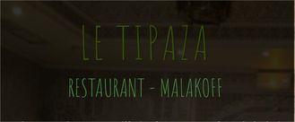

+ Présentation sommaire du séminaire

## Dates

Les 6 et 7 juin 2019 à [Montrouge](https://www.agora.insee.fr/cms/sites/agora/home/services/DG/white--fairway/acces-aux-batiments-white-et-fairway.html)

## Liste des sujets
Cette année, le séminaire des développeurs portera sur 4 axes :

* **La qualité du développement**
1.  L'outil PIDILA (Une checklist unique regroupant les critères des différents référentiels et bonnes pratiques du web)
1.  PLIC Jenkins2 en production mise en œuvre du déploiement continu sur l'application Web4G
1.  Selenium vs Cypress : la battle des outils qui testent vos IHM
1.  Comment j'évalue la qualité de mon application ?
1.  Homologations : - une approche par service avec notamment une volonté d'aller vers de la qualification de service (par exemple le SEF ou Keycloak).

* **Mieux travailler ensemble**
1.  Valeur ajoutée de la DAAP et de la DSMR dans le cadre de la conception ou la modification de l'architecture d'une application
1.  Sécurisation d'un processus de production (LEI) ; présentation à deux voix de l'offre de service de supervision

* **Javascript**
1. Nouvelles applications mobiles : une Progressive Web App dans la tablette des enquêteurs Prix
1. ENO/Lunatic : Embarquer des quesitonnaires JS dans une application #metadata-driven
1.  Antlr : Outillage sur les contrôles, exemple avec le langage VTL : Présentation de l'outillage Antlr pour équiper nos applications Java/JS de services de validation, autocompletion, analyse syntaxique. Exemple à partir du langage VTL.

* **Sujets divers en lien avec le SDSI**

1. Offre de services autour des annuaires et des dispositifs d'authentification (DAAP/DOT)
1. Possibilités de keycloak via son interface d'administration
1. Prendre le contrôle sur Git : gitflow 
1. Les pires conseils du monde sur la migration à Postgre
1. Moteur de recherche dans JAHIA
1. Open source : pourquoi ouvrir nos développements et comment ?
1. Reconnaître automatiquement les concepts dans des publications : vers un bout de datascience entre Rmes et Web4G ?
1. Intégration de ARC dans l'ESSNet I3S
1. Retour d'expérience d'incubation sur la dockerisation et livraison en continu
1. Le web en Python

## Programme
Affiche du séminaire 

## PRATIQUE

## Salle
Le séminaire se déroulera salles Closon/Malinvaud au rez-de-chaussée du bâtiment.

Le numéro de pont pour suivre les présentations en visioconférence est le XXXXX.

## Hôtels
[Liste des hôtels et apparthôtels en accord tarifaire avec l'Insee](https://www.agora.insee.fr/files/live/sites/agora/files/shared/agora/DG/Procedures/Hotels%20et%20residhome%20INSEE%202019.pdf)

## Repas
Le midi des 6 et 7 juin, vous avez possibilité de déjeuner au restaurant administratif du White. Pour les extérieurs, des tickets vous seront mis à disposition (+ modalités).

Le SNDI-P vous propose un moment de convivialité autour d'un repas le jeudi soir au restaurant le Tipaza, à deux pas de la DG. Un menu couscous / vin / dessert vous est proposé pour 25€. Rendez-vous à 19h30.

